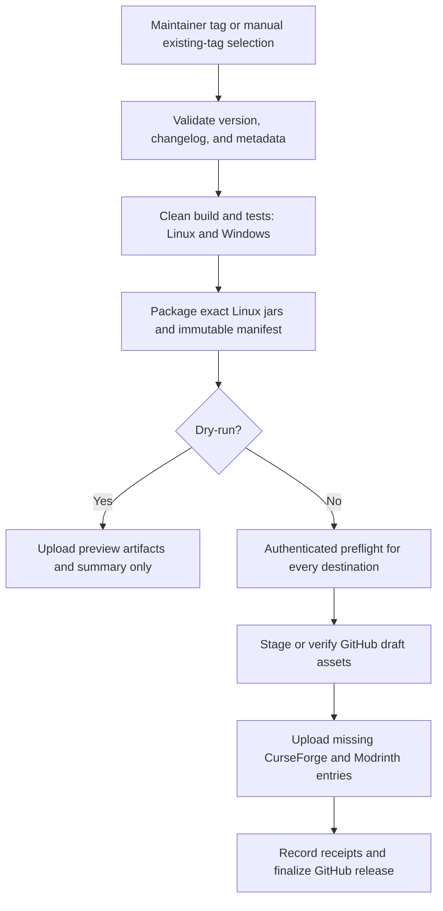

# Automated publishing plan

Status: workflows, release tooling, recovery tests, and setup documentation are implemented locally. Local clean builds, artifact previews, and workflow linting are verified. GitHub-hosted runs, authenticated platform checks, repository settings, and first live publication remain unverified. No commits, tags, pushes, or platform uploads were performed. Treat platform setup as unverified until the maintainer runs preflight.

The assistant must never commit, create/push tags, push branches, or publish merely because a publishing system exists. Repository publishing is a maintainer-controlled workflow. The selected trigger below governs that workflow after implementation, not assistant authorization.

## Agreed direction and implementation defaults

Confirmed by the user: version-tag pushes authorize automatic publication, manual runs default to dry-run, and changelogs use one Markdown file per version with an Unreleased draft. The defaults below are implemented in the checked-in policy and scripts; rollout checks remain below.

| Decision | Implemented behavior |
| --- | --- |
| Publication trigger | A maintainer pushes an existing release tag such as `v4.0.0-rc.1`; ordinary branch pushes and pull requests only validate |
| Manual workflow | Select an existing tag; default to dry-run; explicit publish mode can recover an incomplete release |
| Changelogs | `changelogs/<version>.md`, with `UNRELEASED.md` as the working draft |
| Version authority | `version` in the tagged `gradle.properties`; tag must equal `v` plus that value |
| Game compatibility | Exact `minecraft_version` from that same revision; do not publish the wider metadata version range as tested compatibility |
| Artifacts | Exactly one Fabric jar and one NeoForge jar from the verified Linux build; Windows independently verifies the same source |
| Release body | The same version-specific changelog on all three services |
| First rollout | Publishing remains disabled until projects, secrets, and a dry-run have been reviewed |

No part of the workflow creates or pushes Git refs. The maintainer creates and pushes the release tag; the workflow responds to that explicit action.

## Platform layout

Use one Heavy Inventories project on CurseForge and one on Modrinth. Each release creates two loader-specific entries on each service. GitHub gets one release containing both jars.

| Destination | Published entries | Loader metadata |
| --- | --- | --- |
| CurseForge | Two independent primary files | Fabric on the Fabric file; NeoForge on the NeoForge file |
| Modrinth | Two versions, each with one primary jar | `fabric` or `neoforge`, respectively |
| GitHub Releases | One release with two jars, checksums, changelog, and release manifest | Loader distinguished by filename |

Do not mark either jar as compatible with both loaders, or attach NeoForge as an additional file of the Fabric upload. Exclude common, sources, javadoc, dev, and lifecycle-test jars.

Display names include version and loader, for example `Heavy Inventories 4.0.0-rc.1 (Fabric)`. Give Modrinth entries distinct version numbers, `<version>+fabric` and `<version>+neoforge`; the embedded mod version stays `<version>`. Release classification is derived before adding that platform suffix. Modrinth exposes file, loader, channel, and dependency fields per version. [Modrinth version API](https://docs.modrinth.com/api/operations/createversion/)

| Base mod version | CurseForge / Modrinth channel | GitHub prerelease |
| --- | --- | --- |
| `4.0.0` | release | false |
| `4.0.0-rc.1` | beta | true |
| `4.0.0-beta.1` | beta | true |
| `4.0.0-alpha.1` | alpha | true |

Reject other suffixes until explicitly supported. The current version is `4.0.0-rc.1`. Three-component versions and the earlier four-component form are supported without silently renaming either. Prereleases must not become GitHub's latest stable release. Latest policy: configure one current Minecraft release line (initially `26.1`) in `release/publishing.json`; only newer stable versions on that line can become latest. Compare the numeric version components, not strings. Older-line maintenance releases remain downloadable without displacing the selected latest line.

Declare Fabric API and Cloth Config as required for Fabric. NeoForge requires Cloth Config on clients but not dedicated servers: use required dependency relations as the conservative listing choice and explicitly describe the client-only requirement in release notes. Neither upload API's simple dependency relation represents that distinction fully. Do not falsely label a client requirement as universally optional. Keep platform project IDs/slugs for dependencies explicit and validate them during setup.

## Setup from zero

Follow the [publishing setup guide](PUBLISHING.md) for token creation, exact repository settings, changelog preparation, and tag commands. The workflow is implemented locally and needs a maintainer commit/push before GitHub can run it.

1. Create or verify ownership of the Heavy Inventories listings on CurseForge and Modrinth, including any required initial approval. Record the real project IDs; do not invent them from names.
2. Create publishing tokens in the platforms' account settings with the account/project permissions needed to upload versions. Store values directly in GitHub's repository Actions secrets, never in source files, changelogs, logs, or chat.
3. Add the variables and secrets below. Keep publication disabled until the dry-run and authenticated preflight are complete.
4. Make the workflow available on the repository's default branch for manual dispatch. Protect release tags so only authorized maintainers can create or replace them. Approval via a GitHub environment is optional; it is not assumed or added as an extra required step in this design.
5. Have a maintainer choose the first release tag and enable publishing. Creating platform listings, configuring repository settings, adding credentials, and first live publication are separate setup actions, not work performed by this document.

| Name | Storage | Purpose |
| --- | --- | --- |
| `CURSEFORGE_TOKEN` | Repository Actions secret | CurseForge author upload API token |
| `MODRINTH_TOKEN` | Repository Actions secret | Modrinth token with version-creation and required read access |
| `GITHUB_TOKEN` | Provided automatically by Actions | Release/asset operations with job-level `contents: write`; no extra GitHub PAT by default |
| `CURSEFORGE_PROJECT_ID` | Repository Actions variable | Actual CurseForge project ID |
| `MODRINTH_PROJECT_ID` | Repository Actions variable | Actual Modrinth project ID |
| `PUBLISH_ENABLED` | Repository Actions variable | Must be exactly `true` for a live run; absent/false disables publication |

Use the CurseForge author upload API, not a catalog API key intended for browsing mods. Authenticate through its header, not a token in a URL. Its API accepts Markdown changelogs, release channels, file compatibility, and dependency relations; a successful upload returns a file ID. [CurseForge upload API](https://support.curseforge.com/support/solutions/articles/9000197321)

GitHub provides the workflow token; limit write permission to the publishing job. Build and validation jobs remain read-only and receive no platform tokens. [GitHub token permissions](https://docs.github.com/en/actions/tutorials/authenticate-with-github_token), [repository secrets](https://docs.github.com/en/actions/how-tos/write-workflows/choose-what-workflows-do/use-secrets)

## Workflow architecture



Refactor the existing build matrix into reusable validation/build jobs, retaining ordinary branch/PR checks. The release workflow must wait for both operating systems at the exact selected commit; a previous green result on a moving branch is insufficient. No `release: published` trigger chain is needed: one workflow coordinates all destinations. The existing CI does not launch Minecraft; release acceptance still includes the project's separately recorded gameplay checks.

Resolve the tag once to a commit SHA and use that SHA for source, properties, changelog, and build. Recheck that the tag has not moved before publication. Check allowed release-line ancestry (`main` initially, configured in `release/publishing.json`); do not execute secrets-bearing workflows for pull-request heads or arbitrary unreviewed branches. Manual workflow dispatch requires the workflow on the default branch. [GitHub workflow events](https://docs.github.com/en/actions/reference/workflows-and-actions/events-that-trigger-workflows)

Build both loaders, run common tests, verify packaged resources/metadata, and compile the runtime harness. Have Gradle report the exact two `archiveFile` paths into a machine-readable manifest rather than relying on a broad `*.jar` glob. Transfer the verified Linux bundle between jobs; never rebuild separately for each destination. The package contains:

- Both loader jars, with exact filenames, sizes, and SHA-256/SHA-512 hashes.
- `CHANGELOG.md`, rendered from the version-specific source file.
- `SHA256SUMS.txt` and `release-manifest.json`: schema version, base version, tag, commit, Minecraft/Java versions, channel, loader mapping, dependencies, changelog hash, and workflow provenance.

A publish job consumes only this validated bundle and rechecks its hashes. Required IDs/tokens, game/loader tags, GitHub access, Modrinth project/dependency identity, and existing Modrinth version conflicts are checked before the first upload. CurseForge dependency IDs are explicit verified policy values. Its author API cannot prove per-project upload permission or look up an existing file; upload-only token scopes are finally enforced by POST. The setup guide calls out those limits rather than claiming preflight proves them. Missing configuration fails the whole live attempt before creating a draft or uploading files. Platform moderation may still occur after an accepted upload; report that status distinctly from public availability.

The implementation uses Python 3.13 standard-library scripts with narrow CurseForge, Modrinth, and GitHub adapters; no third-party Python dependencies are required. Keep network operations out of normal Gradle `build` tasks. Direct API adapters provide explicit duplicate detection and receipts; a convenience upload action should only replace them if it satisfies those same recovery rules. Workflow actions are pinned to verified commit SHAs.

Use one repository-wide publishing concurrency group and `cancel-in-progress: false`. Serialize publication so a second release cannot interrupt a partially completed one. Dry-runs can use separate concurrency groups. Pass changelogs and manifests as files/structured data, never interpolated shell commands. Never expose tokens to tests, artifacts, or error dumps.

## Partial failure and recovery

Cross-platform publication is not a transaction. CurseForge or Modrinth may already have an accepted/public upload when another target fails. Do not promise rollback or automatically delete published files.

1. Stage the canonical bundle and an initial ledger on a GitHub draft release for the existing tag. Reject a tag/commit, manifest, changelog, metadata, or file-hash mismatch with an existing release. GitHub supports drafts and release assets. [GitHub releases API](https://docs.github.com/en/rest/releases/releases)
2. Before each external upload, persist an intent record in the draft. After a confirmed response, persist the returned file/version ID and receipt. Retain a second copy in workflow artifacts/summary. The ledger identifies destination, loader, project, version, hash, remote ID, and state.
3. On rerun, use the original bundle from the draft, verified against its manifest. Do not rebuild and assume byte identity. Verify Modrinth remote entries and CurseForge acceptance receipts and skip matching uploads; fail on conflicts. Missing destinations alone are candidates for upload.
4. An upload timeout or a crash between upload and receipt is ambiguous. Reconcile using a remote entry and its bytes/hash where possible. If reliable reconciliation is unavailable, especially with the CurseForge author API, stop for maintainer inspection. Do not automatically retry a possibly successful POST. Read-only requests can use bounded retries/backoff.
5. A maintainer can supply a CurseForge file ID and direct ForgeCDN URL for reconciliation. The script validates the CDN file path and hash; project ownership/metadata are explicitly attested by the maintainer after inspecting the author dashboard. A separate `verified_absent` attestation permits retrying an intent that never uploaded, on either platform. Do not provide a generic force-overwrite switch. If certainty cannot be established, leave the run incomplete.
6. Finalize GitHub only when all four external entries have confirmed receipts. Publish both jars and the final summary together. Allow for immutable GitHub releases by doing asset/ledger updates while still a draft. A finished, matching release makes later reruns no-ops; changed bytes require a new version.

No blind full-job retry should recreate external versions. If draft assets or receipts have been lost, inspect/recover remote state first. A manual target selection for recovery must still respect the original manifest and every destination's completion state; it must not silently redefine a three-platform release as complete.

## Changelog contract

The README remains a repository introduction. `CHANGELOG.md` is a navigation index; `changelogs/<version>.md` is the single publishing source. `docs/RELEASE_NOTES.md` points to those files instead of maintaining a second copy. Verification logs and test counts belong in engineering documentation.

While developing, record user-visible changes in `changelogs/UNRELEASED.md`. Before a release, curate those changes into the exact version filename, remove empty headings/placeholders, review compatibility/upgrade notes, and reset Unreleased for future work. Authors do this before the release commit; the workflow never edits, commits, or pushes changelogs. Do not generate player-facing notes automatically from commit subjects.

The release validator requires a nonempty matching version file, matching first heading, and at least one real change. Reject TODO/TBD/template placeholders and publication of `UNRELEASED.md` or `TEMPLATE.md`. Published version files are immutable; normal corrections go in the next version. Publishing retries require the same changelog hash. Do not claim a release is published merely because its file exists.

Use ordinary Markdown and the same rendered body for all platforms. Require inline absolute HTTPS links (relative links, reference-style links, and local paths are rejected). External link availability remains an author review check; dry-run does not make network requests. Avoid local filesystem paths, task links, raw HTML, and platform-specific embeds. Missing or ambiguous release notes must block publication rather than falling back to the README or a stale changelog.

The local `4.0.0-rc.1.md` draft starts from the current release notes. Its presence does not publish or schedule RC1.

## Implementation steps

### 1. Settle the publishing contract

- [x] Confirm tag-triggered publication, manual dry-run default, and per-version changelog layout.
- [ ] Confirm the first release version before live rollout; the current RC1 notes are a prepared draft.
- [ ] Verify/create platform listings and record actual project/dependency IDs without exposing token values.
- [x] Implement conservative required Cloth relations with explicit client-only release notes, prerelease mapping, and configured latest-stable policy.

Acceptance: every version has an unambiguous tag, changelog, channel, loader mapping, and destination.

### 2. Implement changelog and release validation

- [x] Add scripts validating properties, tag, changelog, compatibility, dependency mappings, and manifest schema.
- [x] Generate a preview and exact artifact list; add validation to ordinary CI without secrets.
- [x] Test missing/empty notes, wrong version/tag, prerelease classification, unsupported metadata, and accidental extra jar selection.

Acceptance: invalid releases fail locally/CI before any upload is possible.

### 3. Build and package in dry-run mode

- [x] Reuse the Linux/Windows build matrix and gate preview/publication on both results for the selected SHA.
- [x] Upload the canonical Linux bundle, rendered changelog, checksums, and planned destination summary as workflow artifacts.
- [x] Implement dry-run as a path with no publishing credentials and no external writes.

Acceptance: the dry-run bundle is exactly what a live run will use, and its identity can be checked independently.

### 4. Add platform adapters and recovery

- [x] Implement authenticated preflight, GitHub draft staging, four loader-specific uploads, and GitHub finalization.
- [x] Implement durable intents/receipts, remote reconciliation, hash-conflict rejection, and matching-release no-ops.
- [x] Test every partial-failure position with mocked APIs, including upload succeeded but response/receipt was lost.
- [x] Add concurrency, bounded read retries, rate-limit handling, and sanitized failure summaries.

Acceptance: successful reruns do not duplicate files, and ambiguous outcomes stop rather than guess.

### 5. Configure and verify the first live release

- [ ] Maintainer configures project IDs, tokens, release-tag permissions, and the enable variable.
- [ ] Run an authenticated preflight and inspect the dry-run artifacts/notes on all destination payloads.
- [ ] Maintainer deliberately authorizes the first live release through the agreed trigger.
- [ ] Check each loader entry, dependency declaration, game version, release channel, changelog, downloadable artifact hash, and any moderation status.
- [x] Verify the setup guide's release and recovery procedures against the implemented workflow, including final input names.

Acceptance: all three destinations are accounted for, failure/recovery behavior is verified, and maintainers can repeat the process without editing workflow code for each version.

## Implementation files

These files now exist locally:

```text
.github/workflows/publish.yml             release orchestration
.github/workflows/build-reusable.yml      shared build/verification jobs
release/publishing.json                   nonsecret dependency/platform policy
scripts/release/                          validator, packager, adapters, recovery
scripts/release/tests/                    fixture and mocked-API tests
docs/PUBLISHING.md                        setup, routine releases, recovery
CHANGELOG.md                             changelog index
changelogs/UNRELEASED.md                   editable draft
changelogs/TEMPLATE.md                    authoring template
changelogs/<version>.md                   canonical publishing notes
```

Official documentation checked on 2026-09-25 is linked beside the relevant platform details. Local validation results and remaining rollout checks are recorded in [publishing verification](PUBLISHING_VERIFICATION.md).
